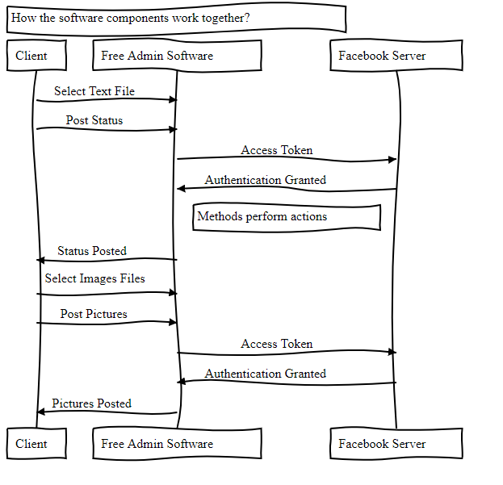

# FreeAdmin Software Architecture Document
Version 0.2 (Draft)

  * [1. Introduction](#1-introduction)
    + [1.1 Purpose](#11-purpose)
    + [1.2 Scope](#12-scope)
    + [1.3 Definitions, acronyms, and abbreviations](#13-definitions--acronyms--and-abbreviations)
    + [1.4 Overview](#14-overview)
  * [2 Architectural Representation](#2-architectural-representation)
  * [3 Logical View](#3-logical-view)
  * [4 Process View](#4-process-view)
  * [5 Implementation View](#5-implementation-view)
  * [6 Quality](#6-quality)
  * [7 Revision History](#7-revision-history)

## 1. Introduction

"Free Admin" works by scheduling multiple posts to be published on a certain page.
It will connect to the Facebook platform server and automatically publish the desired posts or files.

### 1.1 Purpose

The goal of this product is to allow users schedule multiple posts to advertise and manage social media pages with the tools that the software introduce.

### 1.2 Scope

The document is influenced by the process of building the software in which features are connected with one another.
This can lead the project to implement new attributes as well as improve design patterns.

### 1.3 Definitions, acronyms, and abbreviations

* Access token: it contains the security credentials for a login session and identifies the user, the user's groups, the user's privileges, and, in some cases, a particular application.

* Threads: a thread of execution is the smallest sequence of programmed instructions that can be managed independently by a scheduler, which is typically a part of the operating system.

* Binary Attachment: a computer file that is not a text file. Examples of binary files: SAS and SPSS system files, spreadsheets, compressed files, and graphic (image) files.

### 1.4 Overview

The illustrate of how components of the product work with Facebook server and the client to deliver its functionality by multi-threading output.

## 2 Architectural Representation

* Main frame
* Buttons
* Labels
* Fields
* Facebook database

## 3 Logical View

A permission is granted to application for Pages, Groups, and business assets they manage at the individual level. Permissions are strings that are passed along with a login request or an API call.
Components of graphical interface display on the screen to allow users manage the software.
Each feature will perform an action that will interact with the server.

## 4 Process View

* When someone connects with an app using Facebook Login and approves the request for permissions, the app obtains an access token that provides temporary, secure access to Facebook APIs. Access tokens are obtained via a number of methods.

* Methods programmed to work based on the user selection.

* Methods include: select text file, select image files, select video files and three post buttons. Integer text input from user to schedule time.

## 5 Implementation View

## 6 Quality

The sofware perform safe connection with the server to perform the tasks.
App Access token should never be included in any code that could be accessed by anyone other than a developer of the app.

## 7 Revision History
| Date  | Version  | Description  | Author  |
| ------------ | ------------ | ------------ | ------------ |
| 10/02/2020  | 0.1  | Initial draft  | Mustafa  |
| 10/05/2020  | 0.2  | New markdown layout  | Lu  |
|   |   |   |   |
|   |   |   |   |
|   |   |   |   |
|   |   |   |   |
|   |   |   |   |
