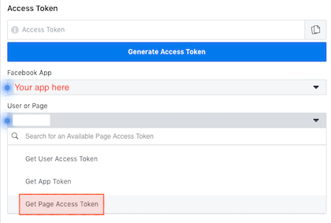
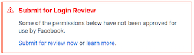
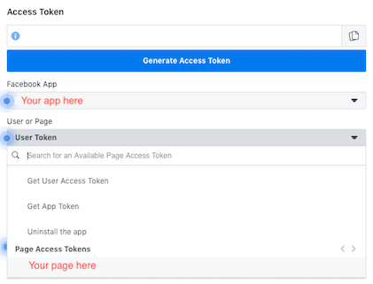

# How to Create a Facebook App and Generate an Access Token

## Creating a Developer Account
In order to create an app and access token, you will need to have a developer account. In order to create one, navigate to the Developer page at https://developers.facebook.com/ and click “Get Started” at the top right of the page and follow the instructions.

## Creating an App
If you have never created apps on the Facebook platform before, you'll need to create an app in order to use the Graph API Explorer feature.

1. Navigate to https://developers.facebook.com/apps/ and click on "Create App"
2. In our example, we'll create an app ID and select "Manage Business Integrations" to describe our app.
3. You'll need to specify an app display name, provide an app contact email, and connect a Business Manager account if applicable.
4. Complete a security check by passing a reCAPCHA challenge.

## Generating the Access Token
An access token generated using this method expires after approximately one hour. Please read the section following on how to obtain an extended access token.

1. Navigate to Facebook Graph API Explorer at https://developers.facebook.com/tools/explorer/
2. Select "Get Page Access Token" and follow the instructions to create/select a page. Note: You might need to repeat instructions 1 and 2 after creating a new page. 

    

3. You may ignore the following warning if shown.

    

4. Under "Add a Permission", make sure "pages_read_engagement" and "pages_manage_posts" are selected.
5. Click "Generate Access Token" and follow the instructions.
6. Click on the page under "Page Access Tokens".

    

7. Copy the access token.

## Generating an Extended Access Token
In order to obtain an access token that lasts for 60 days you can do the following:

1. Navigate to the Access Token Debugger at https://developers.facebook.com/tools/debug/accesstoken/
2. Paste in your existing access token.
3. Click "Extend Access Token" towards the bottom of the page.
4. Right-click and copy the new access token that is displayed in green text.
