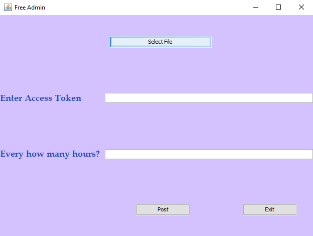

**Sprint 1 Ceremony Minutes**
  
Date: 2020-09-26

Members present:

* Paul Lu
* John Combs
* James Schlesener
* Mustafa Nafia
  
  ## Demo
  
  This sprint, we completed:
  
  * Creating and designing the software using swing graphical user interface.
  * Obtain a page access token to have permission to APIs that read, write, or modify the data belonging to a Facebook Page.
  * Provide resources on how access tokens are used.
  * Created Facebook page to run the tests on. 
  * Developed the software to publish scheduled status on the page timeline.
  * Set up the project to work with Maven for unit testing. 
 
  Here are screenshots of what we did:
  
  

  ## Retro
  
  
  
  ### Pros
  
  * Team communicated effiecively to accomplish assigned tasks.
  * Team was organized and improved the software continuously.
  * The software features passed all tests successfully.
  * Lu improved the software design.
  * James improved documents quality.
  * John improved unit testing process.
  * Mustafa took the lead and did much of the planning and prototyping.

  
  ### Cons
  
  * Working on multiple backlog items conflicts with different members schedules.
  * Setting up Maven to test the software at the beginning.
  * Getting used to the github environment with git bash commands.
  
  ### Actionable Commitments
  
  * As a team, we will work together to deliver a good quality software with its documentation requirements.
  * We will help each other throughout each sprint by communicating and completing unfinished work. 
  
  ## Planning
  
  Points | Story
  -------|--------
    3    | As a client, I want to publish links to sell and advertise my products.
    3    | As a client, I want to post pictures to timeline for new items in store.
    1    | As a client, I want to know how long the access token is valid for.
    1    | As a developer, I will add a document regarding access token info.
    2    | As a developer, I will program my software to publish automatically.
    3    | As a developer, I will create a feature that will post scheduled pictures.
    3    | As a developer, I want to make the software more user-friendly by adding menu bar.
   