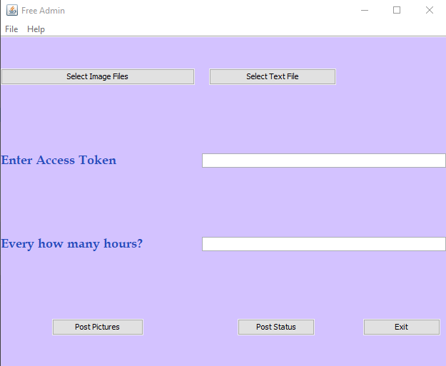

**Sprint 2 Ceremony Minutes**
  
Date: 2020-10-11

Members present:

* Paul Lu
* John Combs
* James Schlesener
* Mustafa Nafia
  
  ## Demo
  
  This sprint, we completed:
  
  * Created a feature that will post scheduled pictures.
  * Made the software more user-friendly by adding menu bar.
  * Added Architecture.md documentation and updated md layout.
  * Tested JRE Compatibility to work under JRE8u261.
  * Tested the software components.
  * Clean up source code.
 
  Here are screenshots of what we did:
  
  

  ## Retro
  
  
  
  ### Pros
  
  * Team shared software updates frequently with each other.
  * Lu improved the Architecture.md file and the layout.
  * Lu tested the JRE compatibility.
  * John created the menu feature to the software
  * James managed the backlog.
  * John and Mustafa cleaned the source code and tested it.
  * Mustafa added the post pictures feature to software.

  
  ### Cons
  
  * Meetings were hard to schedule.
  * Facebook disabled the account we use to test our software.
 
  
  ### Actionable Commitments
  
  * As a team, we will work together to add features and fulfil the sprint requirements.
  * We will keep communicating to deliver the best results timely.

  
  ## Planning
  
  Points | Story
  -------|--------
    2    | As a client, I want to be able to post videos.
    3    | As a client, I do not want compatibility issues.
    2    | As a developer, I will add post video feature to the software.
    2    | As a developer, I will maximize the compatibility without compromising features.
    2    | As a developer, I will identify the design pattern and improve it.
