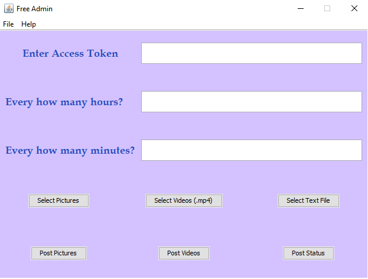

**Sprint 4 Ceremony Minutes**
  
Date: xx-xx-2020

Members present:

* Paul Lu
* John Combs
* James Schlesener
* Mustafa Nafia
  
  ## Demo
  
  This sprint, we completed:
  
  * User is able to make posts at certain hour and minutes.
  * We Made interface simpler by removing the exit button and fixing the resolution.
  * Added testing.md file that describes how the software is being tested.
  * Implemented a queue for posting features.

 
  Here are screenshots of what we did:
  
  

  ## Retro
  
  
  
  ### Pros
  
  * We have organized the software source-code to fit certain design patterns.
  
  ### Cons
  
  * Meetings during holidays.
 
  
  ### Actionable Commitments
  
  * Perform maintinance on the software.

  
  ## Planning
  
  Points | Story
  -------|--------
    3    | As a developer, I will make sure there is unit testing and mock testing for all of the code.
    3    | As a developer, I will make the Graphic User Interface more user-friendly.
